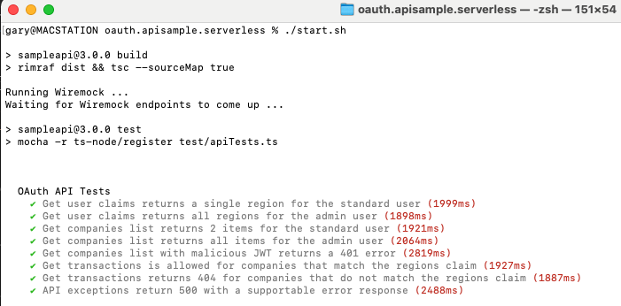

# Final Serverless API 

[](https://www.codacy.com/gh/gary-archer/oauth.apisample.serverless/dashboard?utm_source=github.com&amp;utm_medium=referral&amp;utm_content=gary-archer/oauth.apisample.serverless&amp;utm_campaign=Badge_Grade)

[](https://snyk.io/test/github/gary-archer/oauth.apisample.serverless?targetFile=package.json)
 
## Overview

The Serverless OAuth secured Node.js API code sample, referenced in my blog at https://authguidance.com:

- The API's lambda functions validate a JWT access tokens on every request, in a zero trust manner
- The API takes finer control over OAuth domain specific claims and uses a certified JOSE library
- The API uses JSON request logging and Elasticsearch log aggregation, for measurability

## API serves UI Clients

The AWS deployed API runs as part of an OAuth end-to-end setup, to serve my blog's UI code samples.\
This enables UI code examples to point to API endpoints that run in the AWS cloud:

- [Final Single Page Application](https://github.com/gary-archer/oauth.websample.final)
- [Final Desktop App](https://github.com/gary-archer/oauth.desktopsample.final)
- [Final iOS App](https://github.com/gary-archer/oauth.mobilesample.ios)
- [Final Android App](https://github.com/gary-archer/oauth.mobilesample.android)

## Prerequisites

- Ensure that Node.js 18 is installed
- To run Wiremock, so also install a Java 17 SDK

## Local Development Quick Start

Ensure that Node.js is installed, then run this command to run mocha tests that invoke all lambdas:

```bash
./start.sh
```

The API's clients are UIs, which get user level access tokens by running an OpenID Connect code flow.\
For productive test driven development, the API instead mocks the Authorization Server.\
This enables the API component to be developed and tested in isolation:



This works well enough to meet my low cost deployment goals, though these technical limitations exist:

- The lambdas cannot be run as real HTTP endpoints locally, and be called concurrently from UIs
- The lambdas cannot be load tested locally, due to the slow lambda startup times
- The lambdas cannot use in-memory caching of token signing public keys or custom claims

## Further Information

* See the [Serverless API Overview](https://authguidance.com/2018/12/11/serverless-api-overview) for further details on how the API runs locally
* See the [Serverless API Deployment](https://authguidance.com/2018/12/16/serverless-api-deployment/) post for details on how the API is deployed to the AWS cloud
* See the [Non Functional Behaviour](https://authguidance.com/2017/10/08/corporate-code-sample-core-behavior/) page for a summary of overall qualities

## Programming Technologies

* Node.js and TypeScript are used to implement AWS Lambda Functions

## Infrastructure

* The [JOSE library](https://github.com/panva/jose) is used for to manage in memory validation of JWTs
* [InversifyJS](http://inversify.io) is used to help manage class dependencies
* AWS Route 53 is used for custom hosting domains
* AWS Certificate Manager is used to manage and auto renew the API's SSL certificate
* AWS Cognito is used as the default Authorization Server
* DynamoDB is used to cache JWKS keys and domain specific claims
* The AWS API Gateway is used as the HTTPS internet entry point
* CloudWatch is used for immediate storage of API logs
* API logs are aggregated to [Elastic Cloud](https://authguidance.com/2020/08/11/cloud-elastic-search-setup) to support common [Query Use Cases](https://authguidance.com/2019/08/02/intelligent-api-platform-analysis/)
