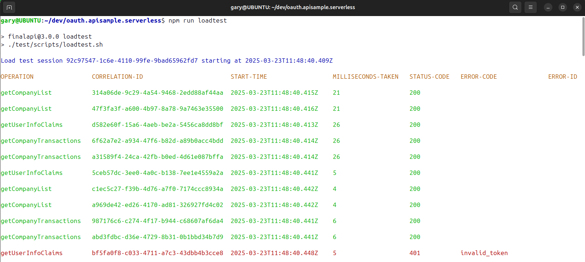

# Final Serverless API 

[](https://app.codacy.com/gh/gary-archer/oauth.apisample.serverless?utm_source=github.com&utm_medium=referral&utm_content=gary-archer/oauth.apisample.serverless&utm_campaign=Badge_Grade)

[](https://snyk.io/test/github/gary-archer/oauth.apisample.serverless?targetFile=package.json)
 
The Serverless OAuth secured Node.js API code sample:

- The API users a zero trust approach and does its own JWT access token validation.
- The API takes control over OAuth claims-based authorization to enable security with good manageability.
- The API uses JSON request logging and can use log aggregation, for the best supportability.

## API Serves Frontend Clients

The API can run as part of an OAuth end-to-end setup, to serve my blog's UI code samples.\
Running the API in this manner forces it to be consumer-focused to its clients:


The AWS deployed API is the default API that the blog's final frontend code samples connect to:

- [Final Single Page Application](https://github.com/gary-archer/oauth.websample.final)
- [Final Desktop App](https://github.com/gary-archer/oauth.desktopsample.final)
- [Final iOS App](https://github.com/gary-archer/oauth.mobilesample.ios)
- [Final Android App](https://github.com/gary-archer/oauth.mobilesample.android)

## API Security is Testable

The API's clients are UIs, which get user-level access tokens by running an OpenID Connect code flow.\
To enable test-driven development, the API instead mocks the authorization server:


A basic load test fires batches of concurrent requests at the API.\
This further verifies reliability and the correctness of API logs.



### API is Supportable

The API loads logs that support aggregation API to enable [Technical Support Queries](https://github.com/gary-archer/oauth.blog/tree/master/public/posts/api-technical-support-analysis.mdx).


## Local Development Quick Start

To run the code sample locally you must configure some infrastructure before you run the code.

### Configure DNS and SSL

Configure custom development domains by adding these DNS entries to your hosts file:

```bash
127.0.0.1 localhost api.authsamples-dev.com login.authsamples-dev.com
```

Install OpenSSL 3+ if required, create a secrets folder, then create development certificates:

```bash
export SECRETS_FOLDER="$HOME/secrets"
mkdir -p "$SECRETS_FOLDER"
./certs/create.sh
```

If required, configure [Node.js SSL trust](
https://github.com/gary-archer/oauth.blog/tree/master/public/posts/developer-ssl-setup.mdx#trusting-a-root-certificate-in-nodejs-apis) for the root CA at the following location:

```text
./certs/authsamples-dev.ca.crt
```

### Run the Code

- Install Node.js 20+.
- Also install Docker to run integration tests that use Wiremock.

Then run the API with this command:

```bash
./start.sh
```

### Test the API

Stop the API, then re-run it with a test configuration:

```bash
npm run testsetup
```

Then run integration tests and a load test:

```bash
npm test
npm run loadtest
```

## Further Information

* See the [API Journey - Server Side](https://github.com/gary-archer/oauth.blog/tree/master/public/posts/api-journey-server-side.mdx) for further information on the API's desired behaviour.
* See the [Serverless API Overview](https://github.com/gary-archer/oauth.blog/tree/master/public/posts/serverless-api-overview.mdx) for further details on the API development and deployment details.

## Programming Languages

* The API uses Node.js, TypeScript and the Serverless framework.

## Infrastructure

* The [jose](https://github.com/panva/jose) library manages in-memory JWT validation.
* AWS Route 53 provides custom hosting domains.
* AWS Certificate Manager issues and auto-renews the API's SSL certificate.
* AWS Cognito is the API's default authorization server.
* The AWS API Gateway provides the internet API entry point.
* The API outputs logs to CloudWatch and they could be shipped to a log aggregation system.
